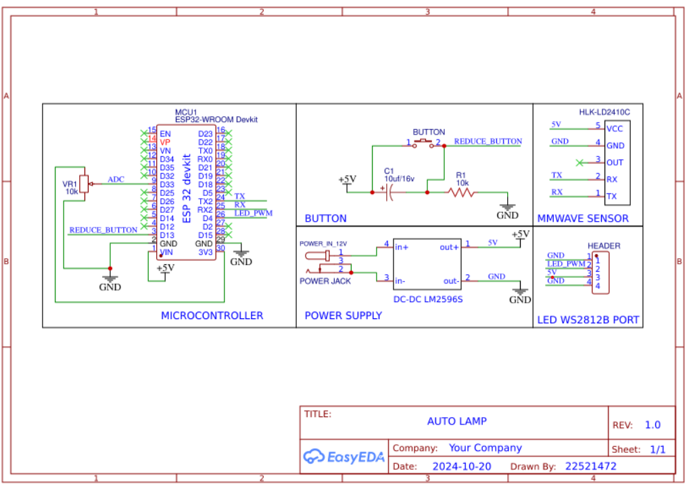
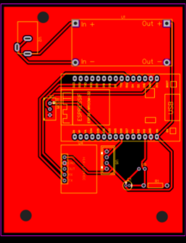

# Lighting Use MMWAVES to support Readers 

This project implements a **smart desk lamp** system that automatically detects human presence using a **mmWave radar sensor (HLK-LD2410C)** and controls an **RGB LED strip (WS2812B)** accordingly. The project uses **ESP32** and is developed using **ESP-IDF framework**.

## Overview

This system utilizes a **mmWave radar sensor** to detect subtle human motion or presence. When a user is detected near the reading area (e.g., sitting at a desk), the lamp **automatically turns on**. If no presence is detected for a predefined timeout period, the lamp **turns off** to save power.

## 🛠️ Hardware Overview

| Component             | Description                              |
|----------------------|------------------------------------------|
| **ESP32 DevKit**      | Main controller with Wi-Fi + BLE         |
| **HLK-LD2410C**       | mmWave radar module for human detection  |
| **WS2812B LED strip** | RGB LED lighting                         |
| **DC-DC LM2596S**     | Buck converter from 12V to 5V            |
| **Button + Potentiometer** | For manual test and ADC testing        |
| **Custom PCB**        | Designed using EasyEDA (see below)       |

## 🔌 Wiring Diagram (Schematic)

- `HLK-LD2410C` communicates with ESP32 via **UART** (TX/RX).
- `WS2812B` is controlled by ESP32 via **PWM on GPIO26**.
- The **DC-DC converter** steps down from 12V (input) to 5V (logic).
- **Button** is pulled-up with 10k and debounced with 10uF cap.
- **Potentiometer** connects to ADC for brightness tuning (optional).

## 🧩 PCB Layout

## 🎯 Features

- Human presence detection using mmWave sensor (LD2410C)
- LED strip control using WS2812B (PWM on GPIO)
- Custom PCB and schematic using EasyEDA
- Expandable firmware using modular C source files
- Built using ESP-IDF (CMake) for performance & scalability
